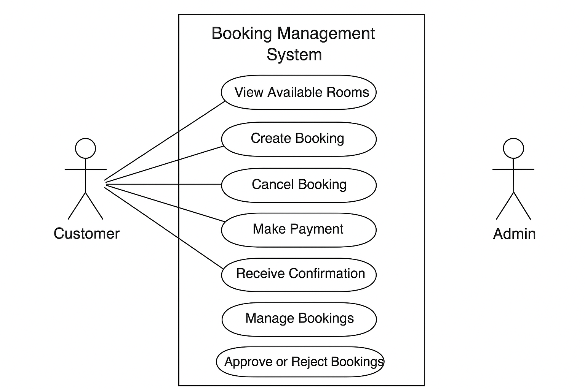

# Requirement-analysis
# Requirement Analysis in Software Development

## Introduction
This repository explores the concept of **Requirement Analysis** in the Software Development Life Cycle (SDLC).  
It explains its importance, activities, types of requirements, and related tools such as Use Case Diagrams and Acceptance Criteria.  
The goal is to understand how clear and complete requirements help ensure successful software projects.

---

## What is Requirement Analysis?
**Requirement Analysis** is the process of identifying, documenting, and managing the needs and expectations of stakeholders for a software system.  
It focuses on understanding *what the system should do* and *how it should perform* before actual development begins.  

### Importance in SDLC
Requirement Analysis acts as the foundation of the software development process.  
It ensures that developers build the right product that satisfies user and business needs while minimizing misunderstandings and rework later.

---

## Why is Requirement Analysis Important?

1. **Prevents Miscommunication**  
   Clear requirements align developers, clients, and users around a shared vision of what needs to be built.

2. **Reduces Development Costs**  
   Identifying requirements early avoids expensive changes and fixes during later stages of development.

3. **Improves Product Quality**  
   Well-defined requirements lead to systems that are reliable, user-friendly, and aligned with customer expectations.

4. **Facilitates Better Project Planning**  
   Knowing what must be built allows accurate time estimation, resource allocation, and risk management.

---

## Key Activities in Requirement Analysis

- **Requirement Gathering**  
  Collecting information from stakeholders, end-users, documents, and observations to understand their needs.

- **Requirement Elicitation**  
  Using interviews, questionnaires, workshops, or brainstorming sessions to extract detailed requirements.

- **Requirement Documentation**  
  Writing the gathered requirements clearly in an SRS (Software Requirements Specification) document.

- **Requirement Analysis and Modeling**  
  Studying the documented requirements for feasibility, consistency, and completeness, and representing them visually (e.g., with use case diagrams or flowcharts).

- **Requirement Validation**  
  Ensuring that the documented requirements truly reflect user needs and are testable and achievable.

---

## Types of Requirements

### **Functional Requirements**
Functional requirements define **what the system should do** — the features, tasks, and services it must provide.

**Example (Booking Management Project):**
- Users can create and manage bookings.
- The system must allow customers to view available rooms.
- Admins can approve or cancel bookings.
- The system should generate booking confirmation emails automatically.

### **Non-functional Requirements**
Non-functional requirements specify **how the system should behave** — focusing on quality, performance, and constraints.

**Example (Booking Management Project):**
- The system must handle up to **1,000 concurrent users** without crashing.
- Page loading time should not exceed **3 seconds**.
- The system must be accessible via **mobile and desktop** devices.
- User data must be stored **securely and comply with data privacy policies**.

---

## Use Case Diagrams

Use Case Diagrams visually represent the interaction between **actors** (users or external systems) and the system itself.  
They help identify functional requirements and clarify system boundaries.

**Benefits of Use Case Diagrams:**
- Simplify communication between stakeholders and developers.
- Provide a clear overview of system functionality.
- Serve as a foundation for test case design and documentation.

### **Booking System Use Case Diagram**
Below is an example of a use case diagram for a booking management system.  
It shows the main actors (Customer, Admin) and their interactions with the system.

---

## Acceptance Criteria

**Acceptance Criteria** are predefined conditions that a software feature must meet to be accepted by the client or end-user.  
They act as a checklist to verify whether a requirement has been fully implemented.

### **Importance**
- Define clear expectations for both developers and clients.  
- Serve as the basis for testing and validation.  
- Reduce ambiguity by specifying what “done” means for each feature.

### **Example (Checkout Feature in Booking System)**
**Feature:** Checkout and Payment Processing  

**Acceptance Criteria:**
1. The system must allow users to review booking details before payment.  
2. Payment must be processed securely via integrated payment gateways.  
3. Users must receive a booking confirmation email within 5 minutes of successful payment.  
4. If payment fails, the user must be notified with an error message and prompted to retry.  

---

### ✅ Repository Summary
- **Repository Name:** requirement-analysis  
- **Main File:** README.md  
- **Image File:** alx-booking-uc.png (Use Case Diagram)

---
